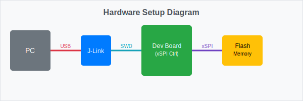
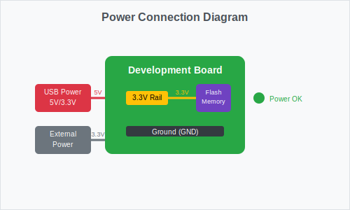
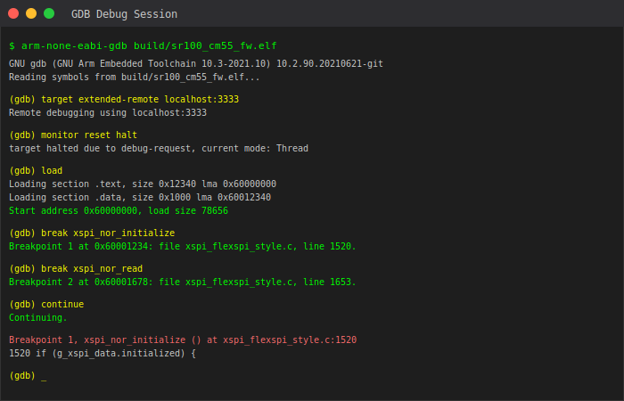
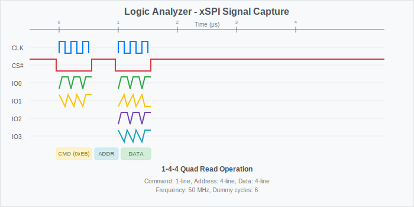

# OpenOCD Debug Guide for xSPI Flash Driver

This guide provides step-by-step instructions for debugging the xSPI flash driver using OpenOCD and GDB.

## Table of Contents
- [Prerequisites](#prerequisites)
- [Hardware Setup](#hardware-setup)
- [OpenOCD Configuration](#openocd-configuration)
- [Debugging Session](#debugging-session)
- [Common Debug Scenarios](#common-debug-scenarios)
- [Troubleshooting](#troubleshooting)

## Prerequisites

### Software Requirements
- OpenOCD 0.12.0 or later
- ARM GDB (arm-none-eabi-gdb)
- J-Link drivers (if using J-Link debugger)
- SDK build environment

### Hardware Requirements
- Development board with xSPI controller
- J-Link or compatible JTAG/SWD debugger
- USB cables for power and debug connection
- xSPI flash memory device (Winbond, Macronix, GigaDevice, etc.)



## Hardware Setup

### 1. Board Connections

Connect your hardware as shown in the diagram:

```
[PC] ←USB→ [J-Link] ←SWD→ [Dev Board] ←xSPI→ [Flash Memory]
```

### 2. Power Configuration

Ensure proper power supply to the development board:
- Connect USB power or external power supply
- Verify 3.3V rail is stable
- Check that flash memory is properly powered



### 3. SWD/JTAG Connection

Connect the debugger to the development board SWD interface:

| J-Link Pin | Board Pin | Signal |
|------------|-----------|--------|
| 1          | VCC       | 3.3V   |
| 7          | SWDIO     | SWDIO  |
| 9          | SWCLK     | SWCLK  |
| 15         | nRESET    | RESET  |
| 4,6,8,10,12,14,16,18,20 | GND | Ground |

## OpenOCD Configuration

### 1. Create OpenOCD Configuration File

Create `xspi_debug.cfg` in your project directory:

```tcl
# xSPI Debug Configuration
source [find interface/jlink.cfg]

# Set adapter speed
adapter speed 4000

# Target configuration
source [find target/cortex_m.cfg]

# Target specific settings
set CHIPNAME target
set CPUTAPID 0x6ba02477

# CM55 Core configuration
target create $_CHIPNAME.cm55 cortex_m -endian little -chain-position $_CHIPNAME.cpu

# Flash configuration for xSPI
flash bank xspi_flash external 0x60000000 0x1000000 1 1 $_CHIPNAME.cm55

# Reset configuration
reset_config srst_only srst_nogate

# Initialize
init

# Enable semihosting
arm semihosting enable

# Halt after reset
reset halt
```

### 2. Launch OpenOCD

```bash
openocd -f xspi_debug.cfg
```

Expected output:
```
Open On-Chip Debugger 0.12.0
Licensed under GNU GPL v2
Info : J-Link initialization started / target CPU reset initiated
Info : J-Link V11 compiled Feb  2 2021 16:47:23
Info : Hardware version: 11.00
Info : VTarget = 3.300V
Info : clock speed 4000 kHz
Info : SWD DPIDR 0x6ba02477
Info : target.cm55: hardware has 8 breakpoints, 4 watchpoints
Info : starting gdb server for target.cm55 on 3333
```


## Debugging Session

### 1. Connect GDB

In a separate terminal, launch GDB:

```bash
arm-none-eabi-gdb build/sr100_cm55_fw.elf
```

Connect to OpenOCD:
```gdb
(gdb) target extended-remote localhost:3333
(gdb) monitor reset halt
(gdb) load
(gdb) monitor reset halt
```

### 2. Set Breakpoints

Set breakpoints in xSPI driver functions:

```gdb
# Break at driver initialization
(gdb) break xspi_nor_initialize

# Break at read/write operations
(gdb) break xspi_nor_read
(gdb) break xspi_nor_write

# Break at SFDP detection
(gdb) break xspi_configure_from_sfdp

# Break at quad mode enable
(gdb) break xspi_enable_quad_mode
```

### 3. Start Debugging

```gdb
(gdb) continue
```



## Common Debug Scenarios

### 1. Flash Detection Issues

If flash is not detected properly:

```gdb
# Check JEDEC ID reading
(gdb) break xspi_read_jedec_id
(gdb) continue
(gdb) print/x jedec_id[0]
(gdb) print/x jedec_id[1] 
(gdb) print/x jedec_id[2]
```

### 2. SFDP Parameter Issues

Debug SFDP parameter reading:

```gdb
# Break at SFDP header reading
(gdb) break jesd216_sfdp_read
(gdb) continue

# Examine SFDP data
(gdb) x/16xw sfdp_header
(gdb) x/64xw bfp_table
```

### 3. Quad Mode Enable Problems

Debug quad mode configuration:

```gdb
# Check QER detection
(gdb) break xspi_read_qer_from_sfdp
(gdb) continue
(gdb) print qer_type

# Check status register operations
(gdb) break xspi_read_status
(gdb) continue
(gdb) print/x status_value
```

### 4. xSPI Controller Register Inspection

Examine xSPI controller registers during operation:

```gdb
# Check controller configuration
(gdb) x/x 0x40000000  # XSPI_CTRL_BASE_ADDRESS
(gdb) x/x 0x40000004  # Control config register
(gdb) x/x 0x40000008  # Status register

# Check LUT entries
(gdb) x/16xw 0x40000200  # LUT table base
```


### 5. Memory Operations Debug

Debug read/write operations:

```gdb
# Set watchpoint on data buffer
(gdb) watch *((char*)data_buffer)

# Check XIP memory space
(gdb) x/64xw 0x60000000  # XIP base address

# Monitor flash operations
(gdb) break xspi_nor_write_page_stig
(gdb) continue
(gdb) print/x address
(gdb) print length
(gdb) x/16xb data
```

## Troubleshooting

### Common Issues and Solutions

#### 1. Connection Problems

**Issue**: OpenOCD cannot connect to target
```
Error: SWD DPIDR 0x00000000
Error: Could not initialize the debug port
```

**Solution**:
- Check SWD connections
- Verify target power
- Reduce adapter speed: `adapter speed 1000`
- Try different reset configuration

#### 2. Flash Access Errors

**Issue**: Cannot read/write flash memory
```
Error: Failed to read flash status
Error: Flash operation timeout
```

**Solution**:
- Verify flash power supply
- Check xSPI controller initialization
- Ensure correct flash device configuration
- Verify LUT table programming

#### 3. SFDP Reading Failures

**Issue**: SFDP parameters cannot be read
```
SFDP header read failed
Invalid SFDP signature
```

**Solution**:
- Check flash device compatibility
- Verify SFDP read command (0x5A)
- Ensure proper dummy cycles
- Try different read modes (1-1-1 first)

#### 4. Quad Mode Issues

**Issue**: Quad mode enable fails
```
QE bit not set after write
Quad read operations fail
```

**Solution**:
- Verify QER type detection
- Check manufacturer-specific QE procedures
- Ensure proper write enable sequence
- Verify status register write operations

### Debug Commands Reference

| GDB Command | Description |
|-------------|-------------|
| `info registers` | Show CPU registers |
| `backtrace` | Show call stack |
| `print variable` | Print variable value |
| `x/NUaddr` | Examine memory |
| `watch expression` | Set watchpoint |
| `monitor reset` | Reset target via OpenOCD |
| `monitor halt` | Halt target execution |

### OpenOCD Monitor Commands

| Command | Description |
|---------|-------------|
| `monitor reset halt` | Reset and halt target |
| `monitor reg` | Show registers |
| `monitor flash info 0` | Show flash bank info |
| `monitor mdw address` | Read word from memory |
| `monitor mww address value` | Write word to memory |

## Advanced Debugging Techniques

### 1. Logic Analyzer Integration

For complex timing issues, use a logic analyzer to capture SPI signals:

```
Channels to monitor:
- CLK: xSPI clock
- CS#: Chip select
- IO0-IO3: Data lines (quad mode)
- IO4-IO7: Additional data lines (octal mode)
```



### 2. Performance Profiling

Profile flash operations:

```gdb
# Time flash operations
(gdb) set $start = $pc
(gdb) continue
(gdb) set $end = $pc
(gdb) print $end - $start
```

### 3. Automated Test Scripts

Create GDB scripts for automated testing:

```gdb
# test_flash.gdb
define test_flash_read
    break xspi_nor_read
    continue
    print "Read operation started"
    continue
    print "Read operation completed"
end

define test_flash_write  
    break xspi_nor_write
    continue
    print "Write operation started"
    continue
    print "Write operation completed"
end
```

## Conclusion

This guide provides comprehensive debugging support for the Sabre xSPI flash driver. Use the appropriate debugging techniques based on your specific issue:

- **Connection issues**: Start with basic OpenOCD connection
- **Flash detection**: Debug JEDEC ID and SFDP reading
- **Mode configuration**: Focus on quad/octal mode enable sequences
- **Data operations**: Monitor read/write operations and memory access
- **Performance issues**: Use profiling and logic analyzer capture

For additional support, refer to the driver source code comments and the xSPI controller documentation.

---

**Note**: Replace placeholder images in the `_static/assets/` directory with actual screenshots and diagrams from your debugging setup.
